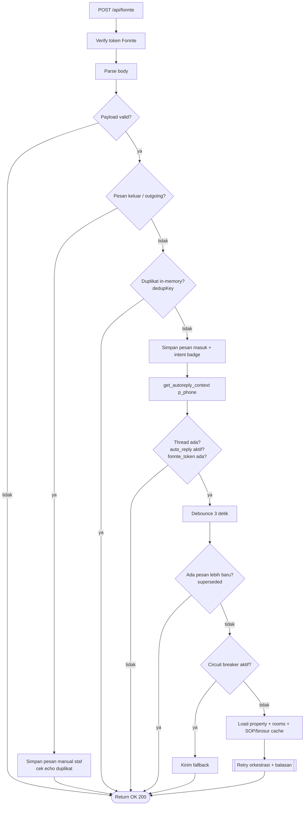
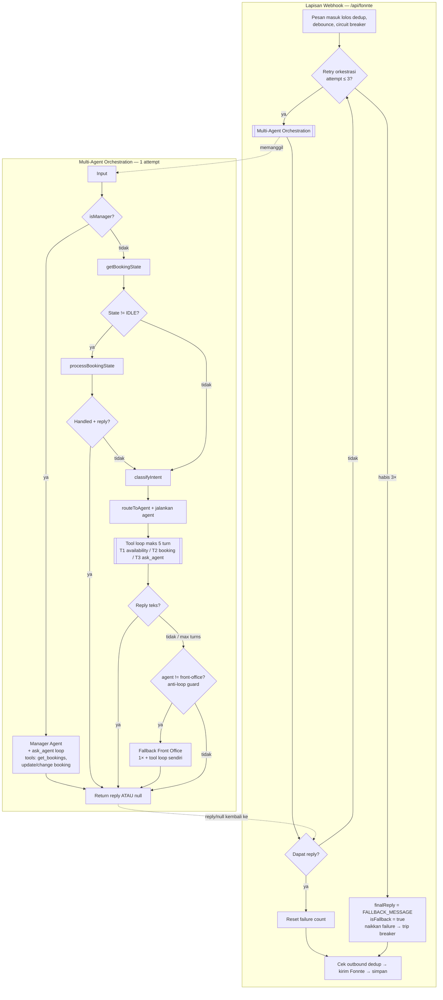
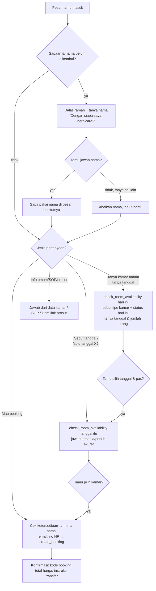

# Alur Chatbot WhatsApp (Fonnte)

Dokumen ini menggambarkan alur runtime chatbot, berdasarkan kode di
[`src/routes/api.fonnte.ts`](../src/routes/api.fonnte.ts),
[`src/ai/multi-agent-orchestrator.ts`](../src/ai/multi-agent-orchestrator.ts),
dan agent di [`src/ai/agents/`](../src/ai/agents).

## 1. Pipeline Webhook (penerimaan & balasan)

## 2. Retry webhook + lokasi fallback

Retry yang sesungguhnya ada di lapisan webhook (`MAX_AI_RETRIES = 3`) dan
membungkus seluruh orkestrasi. Pesan fallback (`FALLBACK_MESSAGE`) juga
ditentukan di lapisan webhook — orchestrator hanya mengembalikan `reply`
atau `null`, sehingga user tidak pernah menerima respons kosong.

## 3. Alur percakapan Front Office

## Catatan robustness

- **create_booking** memilih kamar fisik (`pickAvailableRoom`) *sebelum* menulis
  apa pun. Bila tak ada kamar bebas, booking ditolak — menghindari record tamu/
  booking yatim dan mencegah `booking_rooms.room_id = null` secara diam-diam.
- Untuk jaminan anti-overbooking penuh di bawah konkurensi tinggi, idealnya
  ditambah lock transaksional / constraint unik di level database.
