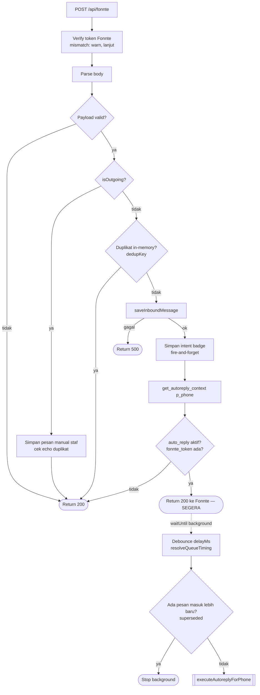
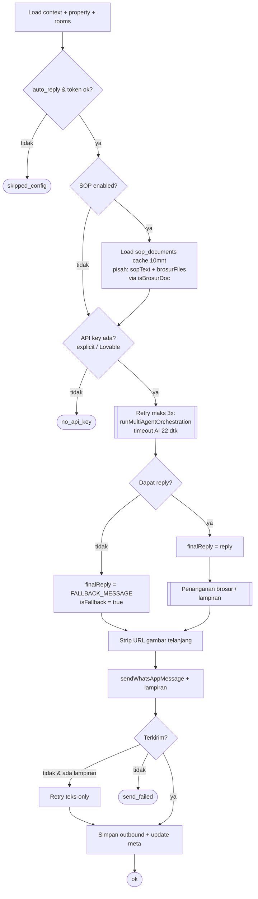
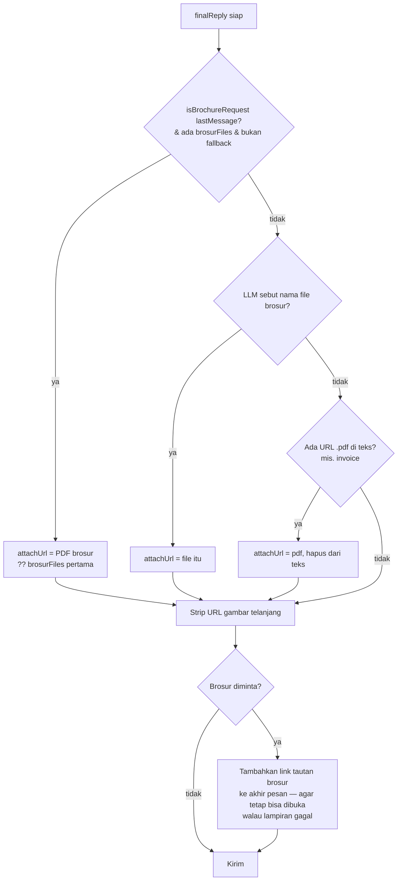
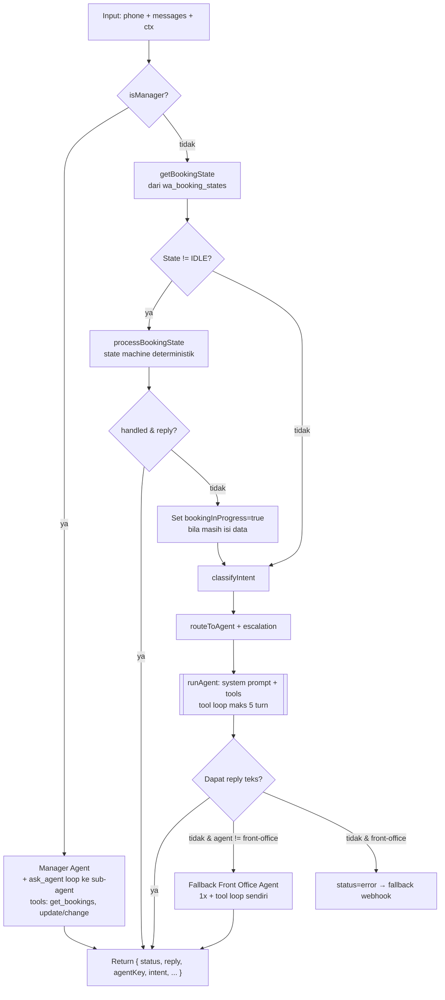
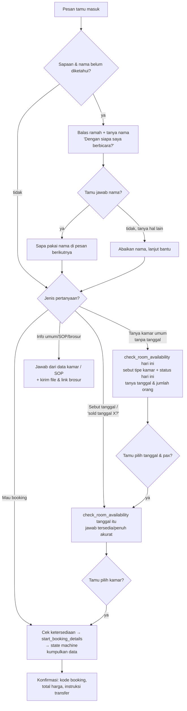

# Alur Chatbot WhatsApp (Fonnte)

Dokumen ini menggambarkan alur runtime chatbot, berdasarkan kode di
[`src/routes/api.fonnte.ts`](../src/routes/api.fonnte.ts),
[`src/services/wa-autoreply.service.ts`](../src/services/wa-autoreply.service.ts),
[`src/ai/multi-agent-orchestrator.ts`](../src/ai/multi-agent-orchestrator.ts),
dan agent di [`src/ai/agents/`](../src/ai/agents).

## 1. Pipeline Webhook (penerimaan & penjadwalan balasan)

Webhook membalas `200` ke Fonnte **segera** setelah pesan masuk disimpan;
pipeline berat (debounce + LLM + kirim) berjalan di background lewat
`ctx.waitUntil` sehingga timeout webhook Fonnte yang singkat tidak mematikan
proses balasan. Di dev lokal (tanpa `waitUntil`) proses tetap di-`await`.

> Catatan: ada juga jalur **queue-worker** (`processWaQueueEntry` di
> `src/services/wa-queue-processor.ts`) yang memproses `wa_conversation_queue`
> dengan logika identik (debounce → claim → AI → kirim). Jalur webhook di atas
> adalah jalur utama yang aktif.

## 2. executeAutoreplyForPhone (inti balasan)

## 3. Penanganan brosur (langkah "Penanganan brosur / lampiran")

Brosur disimpan di tabel `sop_documents` dengan `doc_category = 'brosur'` dan
di-upload lewat tab **Brosur** di Knowledge & SOP. File berada di bucket publik
`brosur` agar URL-nya bisa diunduh Fonnte (SOP/Knowledge tetap privat di
`sop-documents`).

> **Kenapa link + lampiran:** URL lampiran yang tidak terjangkau membuat Fonnte
> menolak seluruh pengiriman (tamu tidak menerima apa pun). Karena itu kode
> me-retry teks-only bila lampiran gagal, dan **selalu menyertakan link** brosur
> di badan pesan saat tamu meminta brosur.

## 4. Multi-Agent Orchestration (1 attempt)

Orchestration memakai **kontrak tiga-status** (`MultiAgentResult.status`):

- `reply` → kirim balasan, berhenti retry.
- `noop` → sengaja diam: tidak kirim apa pun, tidak retry (cadangan).
- `error` → gagal: webhook retry, lalu pakai `FALLBACK_MESSAGE`.

Hanya `error` yang memicu retry, sehingga user tidak pernah menerima respons
kosong dan retry tidak membuang side-effect.

**Agent & tools utama:**

- **Front Office** — `check_room_availability`, `start_booking_details`, `create_booking`
- **Pricing** — tarif dinamis & promo
- **Customer Care** — status & kesiapan kamar
- **Maintenance** — perbaikan & fasilitas
- **Finance** — pembayaran & tagihan
- **Manager** — `ask_agent` (delegasi ke sub-agent)

## 5. Alur percakapan Front Office

## Pengumpulan data booking — alur hybrid

Sapaan, cek ketersediaan, pilih kamar, dan tanya umum tetap ditangani LLM
(Front Office Agent). Begitu tamu memilih tipe kamar + tanggal dan ingin
booking, agent memanggil tool **`start_booking_details`** yang **memindahkan
kontrol** ke state machine deterministik (`src/ai/state-machine/booking-machine.ts`).
Sejak itu, setiap pesan tamu diintersep oleh state machine (state != IDLE),
bukan LLM — sehingga langkahnya konsisten.

State disimpan per-nomor di tabel `wa_booking_states` (RPC
`get_active_booking_state` / `update_booking_state`), berfungsi sebagai memory
temporer percakapan yang auto-reset 15 menit.

Langkah deterministik:

- **`start_booking_details`** → set `CONFIRMING_NAME` (bila nama sudah diketahui
  dari percakapan) atau `AWAITING_NAME`. Menyimpan kamar, tanggal, harga,
  jumlah tamu ke context.
- **`AWAITING_NAME` → `CONFIRMING_NAME`**: tamu mengetik nama → bot bertanya
  pakai nama itu atau nama lain. "Ya" untuk memakai, ketik nama lain untuk
  mengganti.
- **`CONFIRMING_NAME` → `AWAITING_EMAIL`**: minta email.
- **`AWAITING_EMAIL` → `CONFIRMING_PHONE`**: bot menampilkan nomor WhatsApp yang
  sedang dipakai chat (dari `phone` payload, diformat `0xxxx`) dan menanyakan
  pakai nomor itu atau nomor lain. "Ya" → pakai nomor chat; ketik nomor lain →
  pakai itu; minta nomor lain → `AWAITING_PHONE`.
- **`CONFIRMING_PHONE`/`AWAITING_PHONE` → `CONFIRMING_BOOKING`**: tampilkan
  ringkasan.
- **`CONFIRMING_BOOKING`**: bila tamu setuju, state machine memanggil
  `create_booking` **langsung** (bukan via LLM), lalu membalas kode booking,
  total, dan instruksi transfer → `PAYMENT_PENDING`.

`ToolContext.phone` & `AgentContext.chatPhone` diisi orchestrator dari
`input.phone` agar tool dan state machine tahu nomor chat tamu.

### Penanganan interupsi di tengah pengisian data

Bila tamu menanyakan hal lain saat sedang mengisi data booking (mis. "fasilitas
deluxe apa saja?", "AC nya dingin ga?"), state machine TIDAK menghapus progres:

1. `isExpectedAnswer(state, message)` mengecek apakah pesan adalah jawaban yang
   sedang ditunggu (email valid, nomor, "Ya", dll). Bila ya → diproses normal.
2. Bila bukan jawaban DAN terdeteksi pertanyaan (`QUESTION_PATTERN`) atau intent
   eskalasi (`INTERRUPT_INTENTS`: complaint, maintenance, customer-care, pricing,
   payment, availability, booking) → `processBookingState` mengembalikan
   `handled: false` **tanpa mengubah state**.
3. Orchestrator melanjutkan ke LLM untuk menjawab, dan menyetel
   `AgentContext.bookingInProgress = true` sehingga Front Office Agent menjawab
   singkat lalu mengingatkan untuk melanjutkan — tanpa memanggil
   `start_booking_details`/`create_booking` lagi.
4. Pesan tamu berikutnya kembali diintersep state machine pada state yang sama,
   sehingga pengisian data lanjut dari titik terakhir. Hanya "batal/cancel"
   (`CANCELLATION_PATTERNS`) yang benar-benar mereset ke `IDLE`; selain itu
   state auto-reset 15 menit bila percakapan ditinggalkan.

## Catatan robustness

- **create_booking** memilih kamar fisik (`pickAvailableRoom`) *sebelum* menulis
  apa pun. Bila tak ada kamar bebas, booking ditolak — menghindari record tamu/
  booking yatim dan mencegah `booking_rooms.room_id = null` secara diam-diam.
- **Brosur** disimpan di bucket publik terpisah (`brosur`) agar Fonnte dapat
  mengunduhnya; bila lampiran gagal, balasan teks + link tetap terkirim.
- Untuk jaminan anti-overbooking penuh di bawah konkurensi tinggi, idealnya
  ditambah lock transaksional / constraint unik di level database.
