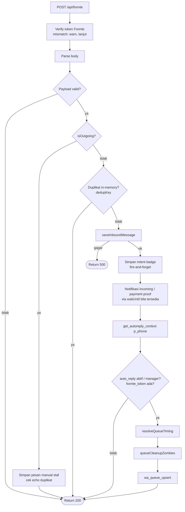
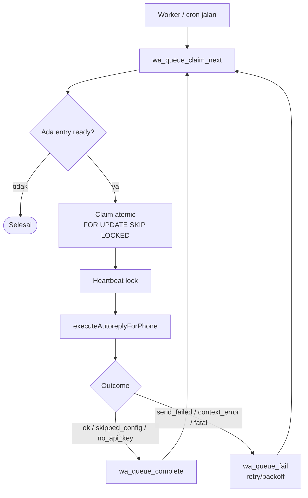
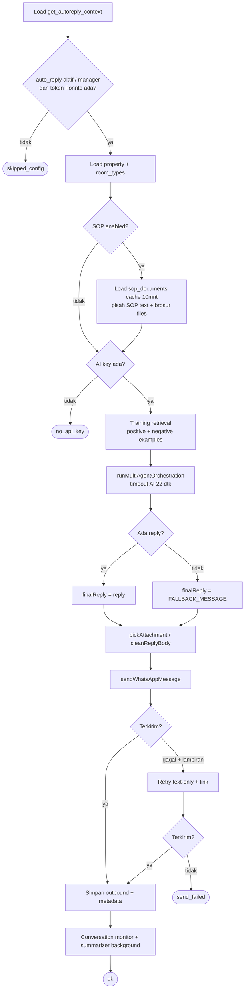
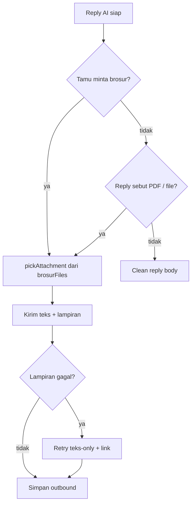
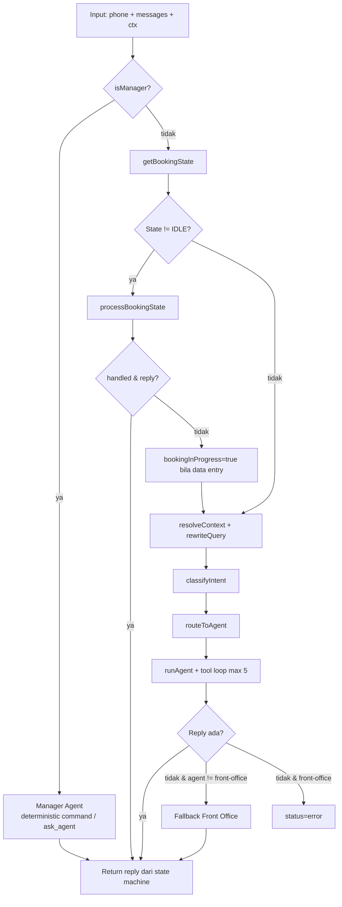
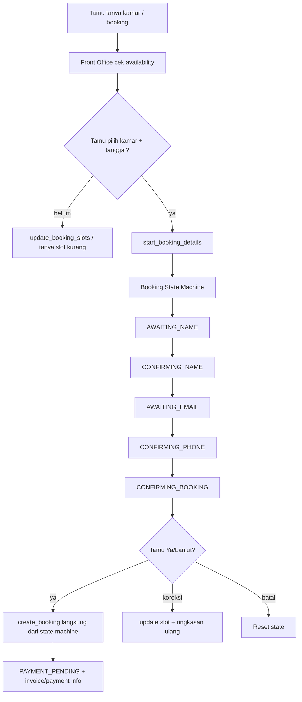

# Alur Chatbot WhatsApp (Fonnte)

Dokumen ini menggambarkan alur runtime chatbot WhatsApp/Fonnte yang aktif di production, berdasarkan kode di:

- `src/routes/api.fonnte.ts`
- `src/services/queue.service.ts`
- `src/services/wa-autoreply.service.ts`
- `src/ai/multi-agent-orchestrator.ts`
- `src/ai/agents/`
- `src/ai/state-machine/booking-machine.ts`

## 1. Pipeline Webhook → DB Queue

Webhook `/api/fonnte` dibuat ringan. Tugas utamanya adalah menerima payload Fonnte, menyimpan pesan inbound, menjalankan notifikasi ringan secara background, lalu memasukkan pesan ke `wa_conversation_queue`. Webhook tidak menjalankan LLM langsung, sehingga bisa return `200 OK` cepat ke Fonnte.

Catatan penting:

- Smart delay/debounce tidak lagi dilakukan dengan sleep di webhook.
- Idle batching dilakukan oleh database lewat `wa_queue_upsert` dengan `process_after` dan `max_wait_until`.
- Worker terpisah (`/api/queue-worker` / `/api/cron/process-wa-queue`) mengambil queue yang sudah ready.

## 2. Queue Worker

Queue worker memproses item yang sudah melewati idle window.

Queue memberi jaminan:

- Satu conversation hanya diproses satu worker pada satu waktu.
- Burst pesan tamu dibalas sekali setelah idle window.
- Worker zombie dibersihkan saat lock expired.
- Error sementara bisa retry dengan backoff.

## 3. executeAutoreplyForPhone

Fungsi ini adalah inti balasan WhatsApp. Ia memuat konteks thread, data properti, tipe kamar, SOP, brosur, model AI, ringkasan chat, contoh training, lalu menjalankan orchestrator.

## 4. Penanganan Brosur / Lampiran

Brosur disimpan di `sop_documents` dengan kategori `brosur` / `brochure`, dan file publiknya berada di bucket publik agar Fonnte bisa mengambil lampiran.

## 5. Multi-Agent Orchestration

Orchestrator memakai kontrak tiga status: `reply`, `noop`, dan `error`.

Agent utama:

- **Front Office** — greeting, cek kamar, availability, start booking detail.
- **Pricing** — tarif, promo, harga.
- **Customer Care** — status kamar dan layanan tamu.
- **Maintenance** — fasilitas rusak/keluhan teknis.
- **Finance** — invoice, pembayaran, tagihan.
- **Manager** — command internal dan delegasi `ask_agent`.

## 6. Booking Flow Tamu

Mode tamu sengaja tidak memberi tool `create_booking` ke Front Office Agent. LLM hanya boleh memulai pengumpulan data lewat `start_booking_details`. Booking final dibuat oleh state machine setelah tamu konfirmasi ringkasan.

Interupsi aman: bila tamu bertanya fasilitas, harga, lokasi, refund, komplain, atau pembayaran saat sedang isi data booking, state machine tidak menghapus progres. Orchestrator menjawab pertanyaan lewat agent lalu melanjutkan state yang sama pada pesan berikutnya.

## 7. Debug Endpoint

Endpoint GET mendukung:

- `?debug=1` untuk cek env, RPC context, queue, LLM reachability, dan pesan terakhir.
- `?test_reply=1&phone=628xxx` untuk menjalankan orchestrator tanpa harus menunggu webhook/queue.
- `?test_reply=1&phone=628xxx&sop=1` untuk mirror produksi dengan SOP dan brosur.
- `?test_reply=1&phone=628xxx&send=1` untuk mengirim hasil test ke WhatsApp.

Debug endpoint wajib diberi token melalui query `token=` atau `Authorization: Bearer ...`.

## 8. Catatan Robustness

- Queue claim dilakukan atomic di database untuk menghindari double reply.
- `create_booking` harus memilih kamar fisik sebelum menulis booking final.
- Lampiran brosur punya fallback text-only agar tamu tetap menerima link.
- Bot-loop / repeated tool `need_dates` dipantau dan bisa men-trigger notifikasi manager.
- Untuk anti-overbooking di beban tinggi, tetap ideal menambah lock transaksional atau constraint unik di level database.
